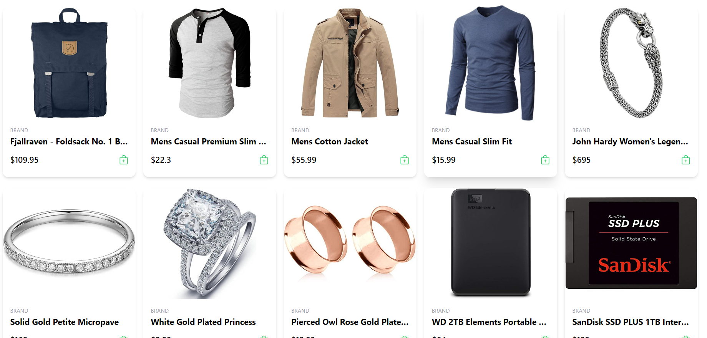
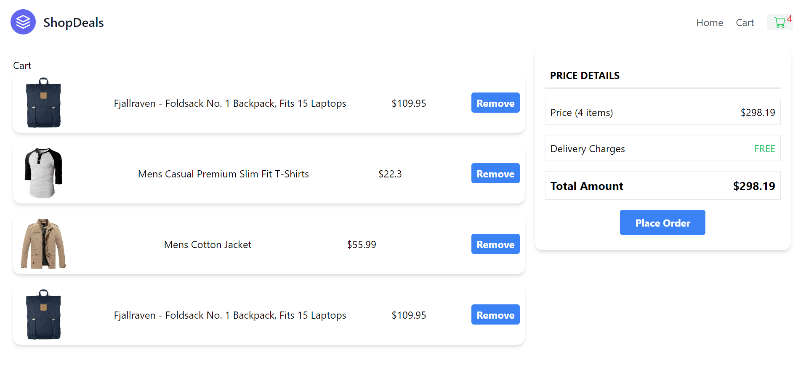

# Shoping Cart Application | React+Redux
Hi, I am **Vipransh Verma**, an aspiring **full stack JavaScript developer**.

It was a great experience in learning  state management in React.js application using Redux.

## Setting Up a Store with Redux
npm install --save redux react-redux

## fake json api for ecom products
https://fakestoreapi.com/products

# Project Images

[Live-Link](https://shopdealz.netlify.app/)

